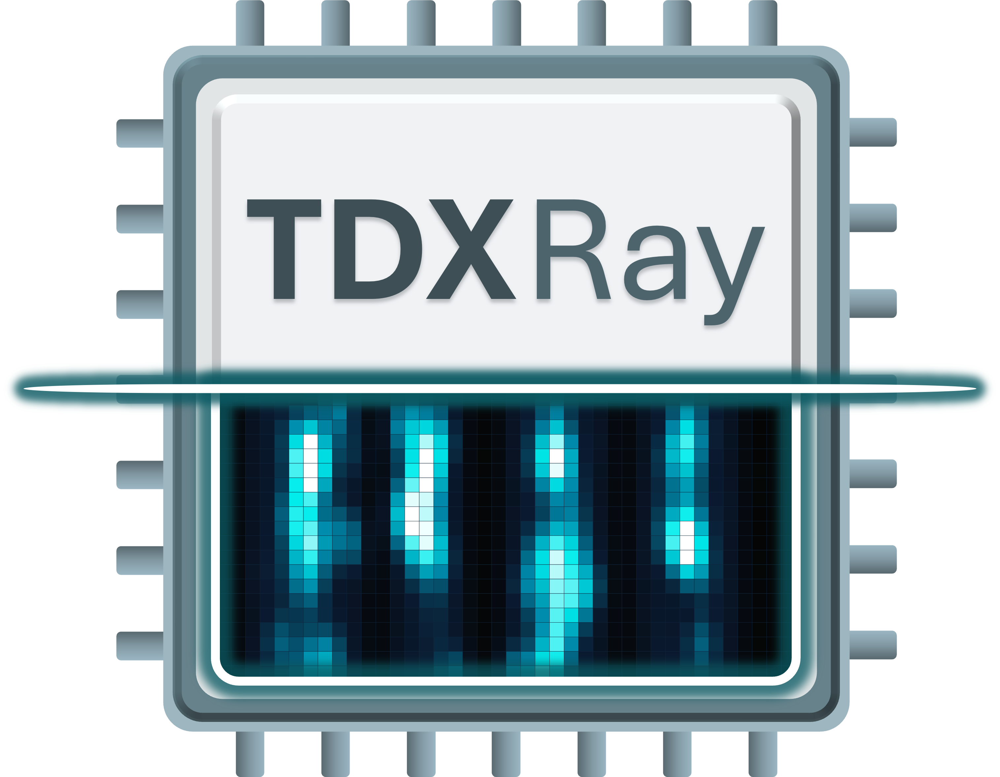

<p align="center">
	
</p>

<p align="center">
	<a href="https://tdxray.cpusec.org/assets/TDXRay_SP26.pdf"><strong>Paper</strong></a>
	&nbsp;|&nbsp;
	<a href="https://tdxray.cpusec.org"><strong>Website</strong></a>
	&nbsp;|&nbsp;
	<a href="https://github.com/hoseinyavarzadeh/tdxray"><strong>Code</strong></a>
</p>

This repository contains demos for the paper **"TDXRay: Microarchitectural Side-Channel Analysis of Intel TDX for Real-World Workloads"**.

For a detailed technical explanation, visit <https://tdxray.cpusec.org>.

## Contents

| Directory          | Content                                                       |
|--------------------|---------------------------------------------------------------|
| `tdxutils/`        | The main kernel module for TDXRay                             |
| `pocs/`            | A series of PoCs to demonstrate our access oracles            |
| `aes_t_table/`     | The AES T-table attack described in Section 4.3. of the paper |
| `prompt-recovery/` | A prompt leakage demo with a cooperating toy victim           |
| `modkmap/`         | A kernel module that grant access to physical memory          |

---

## Hardware Requirements
To successfully reproduce our findings, you need a TDX-enabled Intel CPU.
This includes the 4th, 5th, and 6th generation of Intel Xeon Scalable CPUs, i.e., the Sapphire Rapids, Emerald Rapids, and Granite Rapids microarchitectures.
To enable TDX, either exactly 8 or 16 DIMM slots must be populated.
TDX can be enabled in the BIOS, with the procedure varying by vendor.
Hyperthreading must be enabled.

---

## Setup

### Host Kernel
Our host systems run a TDX-enabled version of Ubuntu 24.04.
Please follow the instructions in [Canonical's official TDX repository](https://github.com/canonical/tdx?tab=readme-ov-file#setup-host-os) to set up such a host.
Additionally, we specifically designed our experiments to work with kernel version **6.8.0-1028-intel**.
This is no longer the newest version, and to our knowledge, binary builds are no longer available for download.
We have not tested whether our experiments still work on the newest kernel version.
**If you encounter problems while building or installing our kernel module, please build and install the correct kernel version manually.**
You can clone the sources for this version from the following repository: [git://git.launchpad.net/~canonical-kernel/ubuntu/+source/linux-intel/+git/noble](git://git.launchpad.net/~canonical-kernel/ubuntu/+source/linux-intel/+git/noble).
The target commit is tagged `Ubuntu-intel-6.8.0-1028.35` (commit ID `7b9d0a48125dac1e82498ceccb20ba5c8aaca9b2`).
For convenience, we provide our exact kernel configuration in `config-6.8.0-1028-intel`.
Please also install the kernel headers with the kernel image.

**Note**: TSX, which is required for TSX-Probe, is disabled by default. Before running any of the experiments, please enable it by appending `tsx=on` to your boot parameters or by running `sudo wrmsr -a 0x122 0`.

### Victim TD
To set up a TDX guest, please follow the instructions in [Canonical's official TDX repository](https://github.com/canonical/tdx?tab=readme-ov-file#setup-host-os).
We use Ubuntu 24.04 for our experiments.
Additionally, **please restrict the target VM to a single virtual core and pin it to a single host CPU core**.
You can achieve this by starting the QEMU command to launch the TD with `taskset -c <target core> <qemu cmd>`, and specifying `-smp 1`.
**Additionally, specify `hostfwd=tcp::12123-:12123` with the network device to expose port `12123` to the host.**
You will have to edit the start script for both of these steps.
**For reference, see `start_victim.py`, which is the start script we use on our test platforms.**

**Important:** 
 * Ensure that while running the experiments, the victim TD is the only TD running on the host system.
 * You can connect to the TD via SSH on `localhost:10022`.

### Building the Experiments
Apart from working C and C++ compilers (`gcc`/`g++` are preferred) and kernel headers, the only external build dependency is `libncurses-dev`.
To build the experiments, copy the artifact folder to your TDX host environment and build it with
```shell
make -j$(nproc)
```

Before running any of the experiments, insert the `tdxutils` kernel module with
```shell
sudo insmod tdxutils.ko
```
If successful, you should now see files called `tdxutils` and `tdx_mwait` in the host's `/dev/` folder.
Additionally, some PoCs require the `modkmap` kernel module, which you can insert with 
```shell
sudo insmod modkmap.ko
```
It should create the `/dev/modkmap` file.

---

## Running the Side Channel PoCs (`pocs` Directory)
### Utility 1: Translating GPAs to HPAs
To translate a guest physical address (GPA) of your TD to a DRAM-backed host-physical address (HPA), run
```shell
./u1-resolve-gpa <GPA>
```

### Utility 2: Creating Memory Accesses in the Victim TD
To create predictable memory accesses in the victim TD, we provide the `u2-contend-code` utility.
This program simply accesses a single cache line in a tight loop.
Please deploy the binary to your victim TD and run it with `sudo ./u2-contend-code`.
It will show the GPA it is accessing.
You can change the access type by pressing Enter while the program is running.
It supports data reads, data writes, code reads, and an ‘OFF’ mode, which does not access anything.

### Utility 3: Splitting Target Pages
By default, the TDX module maps most guest pages as 2MB pages in its SEPT entries.
To achieve higher granularity with SEPTrace, it can be useful to demote the target page to 4k pages.
You can do this by running `./u3-split-single-page <GPA>` on the host.

### PoC 1: A Simple Side Channel PoC with SEPTrace
Run the `u2-contend-code` program in the victim TD and split its target GPA into 4kB pages using `u3-split-single-page` on the host.
Then, run `./1-page-table-attack <GPA>` on the host.
When `u2-contend-code` runs in read, write, or code mode, the program should immediately report a series of accesses.
When in the ‘off’ mode, the number of accesses is expected to be significantly lower, since the target page is accessed only periodically by the guest kernel.

### PoC 2: Observing Access Timings with Load+Probe
Run the `u2-contend-code` program in the victim TD.
Then run `./2-load-probe <GPA>` in the host.
You should see a histogram of timings that the host records while accessing an alias of the victim GPA.
When changing the guest's access mode, the histogram should change, demonstrating an observable timing difference. 
**Note:** You can use the `taskset` utility to pin the PoC to a specific core. The histograms will look different when the PoC is pinned to the victim's thread sibling core.

### PoC 3: MWAIT-Probe and Load+Probe's PMC variant 
Run the `u2-contend-code` program in the victim TD.
Then run `./3-probe-mwait <GPA> <core ID>` in the host.
You can choose any core ID except the victim TD's core.
When `u2-contend-code` runs in read, write, or code mode, the average time difference between MWAIT wake-up events (printed in red) should be much lower than when it is in the ‘off’ state.
This PoC additionally records the access time after a wake-up event (printed in blue), as well as the difference in the “L2_LINES_OUT_SILENT” PMC (printed in green), thus demonstrating Load+Probe and its PMC-based variant.

### PoC 4: TSX-Probe
Run the `u2-contend-code` program in the victim TD.
Then run `./4-tsx-probe <GPA>` on the host.
When `u2-contend-code` runs in read, write, or code mode, the transaction should abort.
In 'off' mode, it should commit.

---

## Running the AES T-Table Attack (`aes_t_table` Directory)

### Running
 1) To build the AES T-Table attack, enter the `aes_t_table` directory and run `make -j $(nproc)`. This will fetch the correct OpenSSL version and build it.
 2) When finished, copy the entire `aes_t_table` directory to the victim TD, and run `./victim`.
 3) The victim will print an attacker command containing a series of target addresses (highlighted in green). Copy this command and run it in the build folder on the host.

### Changing the Configuration
By default, the attack uses TSX-Probe and runs 10 times, with 1000 victim encryptions per run.
If you want to use a different configuration, adjust the parameters in `config.h`, and rebuild the attack.
Note that Load+Probe in the regular non-PMC variant is very sensitive to system noise, and that the upper and lower cache hit thresholds may need to be adjusted to achieve optimal performance.

---

## Stealing LLM Prompts
To demonstrate our side-channel attack on prompt tokenization, we provide a demo for stealing prompts from a cooperating victim.
This victim informs the attacker of the token nodes' addresses, so the demo covers the prompt exfiltration stage of our attack (see Section 5.3 of the paper).

### Setup

This demo requires a patched version of llama.cpp to be installed system-wide on the host.
Additionally, some build artifacts must be deployed to the guest.

On the host machine, install the build dependencies for `llama.cpp` as follows:
```shell
sudo apt-get install cmake gcc g++ curl libcurl4-openssl-dev libssl-dev
```

Then, build and install `llama.cpp` with our patches by running
```shell
./install_llama.sh
```
The script requires root privileges for installing `llama.cpp` system-wide, and may require a password.
Once complete, copy the `llama.cpp/build/bin` directory to the victim TD.

To build the attack itself, navigate to `prompt-recovery/` in the host and run `make`.

Finally, download the target model.
The reference model is a quantized version of Llama 3.2 Instruct, which you can download from here: <https://huggingface.co/unsloth/Llama-3.2-1B-Instruct-GGUF/blob/main/Llama-3.2-1B-Instruct-Q8_0.gguf> (SHA256 starts with `3f87a880027e7b9e`).
Please save the model to both the host and the victim TD.

### Running

On the victim TD, navigate to the llama.cpp `bin/` directory and run 
```shell
sudo ./llama-simple-chat-victim -m <model.gguf>
```
where `<model.gguf>` is the target model.
If successful, the program should run a test prompt and listen for incoming connections.

Next, navigate to the `prompt-recovery/` directory on the host, and run
```shell
sudo ./recover-prompt <model.gguf>
```
with the same target model as the victim.
This will send a test prompt to the victim, which will tokenize it and run the inference.
While this is happening, the attacker in the host monitors the token nodes for memory accesses.

There will be two outputs:
 * Raw - colored red - is a dump of all tokens that were recovered. Fragments of the test prompt should be legible, and there may be two or more repetitions.
 * Isolated - colored yellow - is a composite of the repetitions potentially present in the raw output. This can sometimes yield a cleaner output, but may not always contain something useful.

We consider the attack successful if the raw output contains recognizable fragments of the test prompt.

To specify your own test prompt, put it into a `prompt.txt` file, and run
```shell
sudo ./recover-prompt <model.gguf> -p prompt.txt
```

Note that you have to restart the victim in the TD every time you run the attack.

---

## Troubleshooting
* **TSX-Probe does not work**: TSX is disabled by default, and can be activated by running `sudo wrmsr -a 0x122 0`.  
* **The PoCs fail to start**: Ensure that all kernel modules are loaded and that their files in the `/dev` file system exist  
* `recv: No such file or directory`: Some experiments must communicate with a counterpart in the victim TD. This happens via TCP port `12123`. Make sure that `0.0.0.0:12123` in the guest is forwarded to `localhost:12123` on the host.
